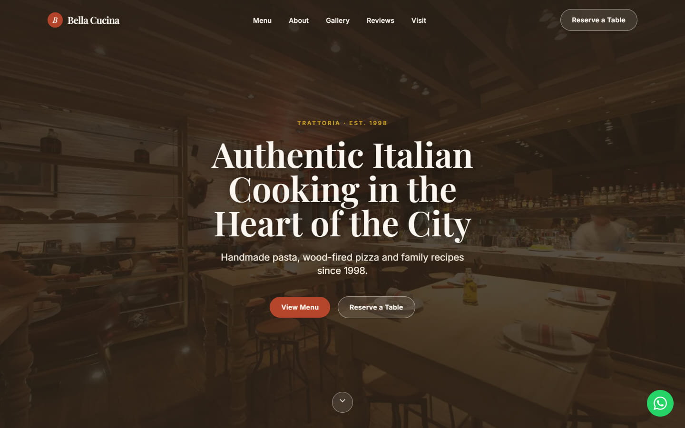
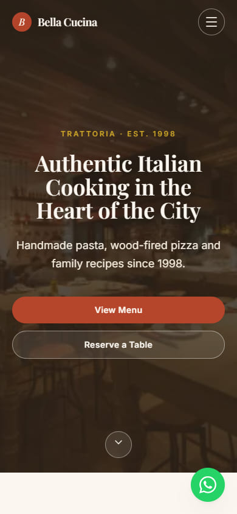

# Bella Cucina

A one-page website for an Italian restaurant: menu, story, gallery, reviews and a booking form that
hands the reservation straight to WhatsApp. Static, fast, and editable from a single config file.



> **Demo project — Bella Cucina is a fictional restaurant.** The menu, the reviews, the address and
> the phone number are all invented. See [DECISIONS.md](DECISIONS.md) for what is real and what is not.

<p align="center">
  
</p>

## What it is

A portfolio build of the kind of site a small restaurant actually needs: somewhere to read the menu,
look at the room, and book a table without downloading anything or creating an account. There is no
backend, no database and no CMS to keep alive — `npm run build` produces a folder of static files
that costs nothing to host and loads in well under a second.

Everything a restaurant owner would want to change — name, phone number, address, opening hours,
social links, the whole menu, the photographs — lives in `src/config/site.ts` and `src/data/`.

## Stack

|           |                                                                       |
| --------- | --------------------------------------------------------------------- |
| Framework | [Next.js 15](https://nextjs.org) (App Router) with `output: 'export'` |
| Language  | TypeScript, strict mode                                               |
| Styling   | [Tailwind CSS 3](https://tailwindcss.com)                             |
| Fonts     | Playfair Display + Inter, self-hosted via `next/font/google`          |
| Icons     | [Lucide](https://lucide.dev), plus inlined brand marks                |
| Map       | OpenStreetMap embed — no API key                                      |
| Tooling   | ESLint (flat config) + Prettier                                       |

No UI kit, no animation library, no analytics, no cookies. The only third-party request the deployed
site makes is the OpenStreetMap iframe in the Visit section.

## Features

**Sections**

- Fixed navbar that turns solid on scroll, highlights the section you are reading, and collapses to
  an accessible drawer on mobile
- Full-bleed hero with the headline, the pitch and two calls to action
- Three highlight cards
- Tabbed menu — Antipasti, Pasta, Pizza, Dolci, Drinks — with prices and vegetarian / gluten-free badges
- About section with the family story and three counters that animate into view
- Masonry gallery with a hand-written lightbox
- Reviews carousel
- Reservation form that opens WhatsApp with the booking already written out
- Visit section with the address, an opening-hours table and a map
- Footer with social links, a dynamic copyright year and the demo notice
- Floating WhatsApp button

**Under the hood**

- **Accessible by construction.** Real semantics throughout; the menu follows the WAI-ARIA tabs
  pattern with roving tabindex and arrow-key navigation; the lightbox and the mobile menu trap focus,
  close on <kbd>Esc</kbd> and return focus where it came from; every control has a name; the focus
  ring is never removed.
- **Motion you can turn off.** Scroll reveals, counters and transitions all check
  `prefers-reduced-motion` and hand over the finished state instead.
- **Degrades without JavaScript.** The reveal animations are armed by a class the page adds itself,
  so with scripting disabled you get the whole document — navbar, menu, photographs, hours, map —
  instead of a page of blank sections. The parts that are scripts by definition (tab switching, the
  lightbox, the carousel and the booking form) need it; nothing else does.
- **Nothing shifts while it loads.** Every image ships with its intrinsic `width` and `height`; the
  hero is eager with `fetchPriority="high"` and everything else is lazy.
- **SEO done properly.** Full metadata, Open Graph and Twitter cards, a generated `og.jpg`,
  `Restaurant` JSON-LD built from the same data the page renders, plus `sitemap.xml` and `robots.txt`.
- **Light assets.** Ten photographs, all WebP, none over 200 KB, each with smaller `srcset`
  siblings generated by `npm run images`, so a phone downloads a 64 KB hero instead of the 190 KB
  desktop file.

## Measured

Lighthouse 12, mobile preset (simulated slow 4G, 4× CPU slowdown), run five times against the
production build served with the brotli compression any static host applies. Median of the five:

| Performance | Accessibility | Best Practices | SEO |
| ----------- | ------------- | -------------- | --- |
| 93          | 100           | 100            | 100 |

Largest Contentful Paint 2.6 s, Total Blocking Time ~190 ms, Cumulative Layout Shift 0,
Speed Index 1.9 s, 368 KB transferred on first load.

The brief set 95 as the bar for all four. Performance lands two points under it on the laptop that
built the site (the same page scored 95–96 in quieter runs earlier in the session — the score moves
with the machine). The lever that would close the gap is rendering only the open menu tab instead of
all five; it was left alone on purpose so the whole menu stays in the HTML for search engines and
for anyone reading without JavaScript. See [DECISIONS.md](DECISIONS.md).

## Run it

Requires Node.js 18.18 or newer.

```bash
npm install
```

```bash
npm run dev
```

Then open <http://localhost:3000>.

| Script                    | What it does                                                               |
| ------------------------- | -------------------------------------------------------------------------- |
| `npm run dev`             | Development server with hot reload                                         |
| `npm run build`           | Static export into `out/`                                                  |
| `npm run preview`         | Serves the built `out/` folder on port 4000                                |
| `npm run lint`            | ESLint                                                                     |
| `npm run format`          | Prettier, with Tailwind class sorting                                      |
| `npm run images`          | Regenerates the responsive variants in `public/images`                     |
| `npm run check:translate` | Drives every control on the built page as if Chrome had auto-translated it |
| `npm run verify`          | Lint, build, then the translation check — run it before every deploy       |

The translation check needs Google Chrome installed (it drives it through Playwright) and serves
`out/` itself on port 4350. `npm run check:translate -- --url https://your-site.example` points it at
a deployed copy instead.

## Make it yours

**1. The business details — `src/config/site.ts`**

Name, tagline, phone, WhatsApp number, email, address, map coordinates, opening hours, social links,
reservation limits and all SEO copy live in one object. Change them there and every component,
the structured data and the sitemap follow.

The four values that need changing sit at the top of the file, above the `site` object, and
everything else is derived from them:

```ts
const NAME = 'Bella Cucina';
const PHONE_E164 = '+12125550148'; // used by the tel: links and the structured data
const PHONE_DISPLAY = '+1 (212) 555-0148'; // the same number, as it reads on screen
const WHATSAPP_NUMBER = '12125550148'; // international format: no +, no spaces, no dashes
```

Change `WHATSAPP_NUMBER` and the floating button and the reservation form both go live. The number
shipped here is a reserved fiction number, so today WhatsApp opens and then rejects it.

**2. The menu — `src/data/menu.ts`**

Five categories, each with an id, a label, a one-line blurb and its dishes:

```ts
{
  id: 'contorni',            // used for the tab and panel ids — keep it URL-safe and unique
  label: 'Contorni',
  blurb: 'Sides, and the vegetables that come with them.',
  items: [
    {
      name: 'Cacio e Pepe',
      description: 'Tonnarelli, Pecorino Romano, cracked black pepper.',
      price: 19,
      tags: ['V'],           // 'V' vegetarian, 'GF' gluten free — both optional
    },
  ],
}
```

Add a category and a sixth tab appears, keyboard navigation included. Prices are plain numbers;
whole numbers render as `$19`, decimals as `$19.50`.

**3. Reviews — `src/data/reviews.ts`** — name, one line of context, a 1–5 rating, the quote and an
ISO date. The carousel sizes itself to however many you add.

**4. Photographs — `src/data/gallery.ts` and `public/images/`**

Drop a WebP into `public/images/`, add an entry with its real pixel dimensions and a description of
what is in the photo, then run `npm run images` so the smaller `srcset` siblings exist:

```ts
{
  src: '/images/pizza-wood-fired.webp',
  alt: 'A margherita pizza blistering inside a wood-fired oven',
  width: 1200,
  height: 900,
  caption: 'Ninety seconds at 900 °F',
}
```

The `width` and `height` must match the file, otherwise the page will shift as it loads. Skipping
`npm run images` leaves the `srcset` pointing at files that do not exist, so run it before you build.

**5. Colours and type — `tailwind.config.ts`**

The five brand colours (`cream`, `ink`, `terracotta`, `olive`, `gold`) and the two font families are
defined once and used everywhere.

## Deploy

The build is a plain folder of static files, so any host works. Two free ones:

### Vercel

```bash
npm i -g vercel
```

```bash
vercel --prod
```

Vercel detects Next.js and needs no configuration. Or push to GitHub and import the repository at
[vercel.com/new](https://vercel.com/new) — every push then deploys itself.

### Netlify

```bash
npm i -g netlify-cli
```

```bash
npm run build
```

```bash
netlify deploy --prod --dir=out
```

Or connect the repository at [app.netlify.com](https://app.netlify.com) with build command
`npm run build` and publish directory `out`.

### Anywhere else

`npm run build` writes `out/`. Upload it to GitHub Pages, Cloudflare Pages, S3, or any web host that
serves files.

**After the first deploy,** set `seo.url` in `src/config/site.ts` to the real domain. The canonical
tag, the Open Graph URLs, the sitemap and the structured data all read from it.

## Project structure

```
src/
  app/
    layout.tsx          metadata, fonts, JSON-LD, skip link
    page.tsx            section order
    globals.css         design tokens, component classes, reduced-motion rules
    sitemap.ts          -> /sitemap.xml
    robots.ts           -> /robots.txt
  components/           Navbar Hero Highlights Menu About Gallery Lightbox
                        Reviews Reservation Visit Footer WhatsAppButton
                        Reveal SocialIcon
  config/site.ts        everything a client would want to change
  data/                 menu.ts  reviews.ts  gallery.ts
  hooks/useInView.ts    IntersectionObserver hook behind the reveals
  lib/                  utils.ts  structuredData.ts  images.ts  domGuard.ts
scripts/images.mjs      generates the responsive variants (npm run images)
scripts/translate-check.mjs  auto-translate regression check (npm run check:translate)
public/
  images/               ten WebP photographs, all under 200 KB,
                        plus the generated -480 / -768 / -1200 / -1600 siblings
  og.jpg  favicon.svg  apple-touch-icon.png  icon-512.png
docs/                   full-page screenshots at 375, 768, 1280 and 1920 px,
                        plus the two crops used above
```

## Credits

Photographs from Unsplash, typefaces from Google Fonts, icons from Lucide and Simple Icons, map from
OpenStreetMap. Every photographer and licence is listed in [CREDITS.md](CREDITS.md).

## Licence

The code is free to reuse. The photographs keep their Unsplash licence and the brand marks remain
trademarks of their owners — see [CREDITS.md](CREDITS.md).
